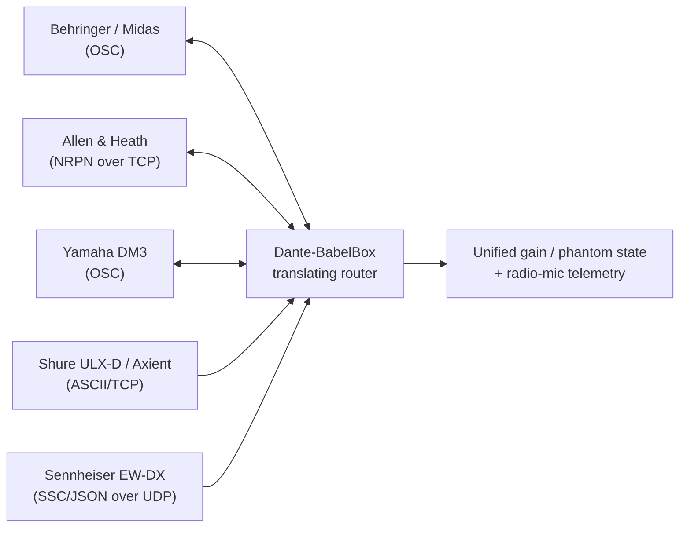

# Dante-BabelBox

> **AI-assisted project.** This codebase was created with [Claude](https://claude.com/claude-code)
> (Anthropic), directed and reviewed by a human author. Adapters are built
> against official/community-authoritative vendor protocol specs (see each
> adapter's module doc comment for its source), but this has **not been
> validated against real hardware** — only against mock devices in the
> test suite. Review before use on live gear.

Cross-vendor Dante control bridge, currently covering two domains:

1. **Preamp control** — bridges gain/phantom-power control across
   Dante-networked mixing consoles and stageboxes from different vendors.
2. **Radio-mic telemetry** — monitors battery, RF signal, and audio level
   from wireless mic receivers, across vendors, whether or not the
   hardware even has a Dante audio option installed (see the "Radio Mic
   Telemetry" sections below for why that doesn't matter here).

Dante carries audio and basic mDNS-based device discovery, but nothing
about preamp gain, phantom power, or wireless-mic status — each vendor
layers its own proprietary control protocol on top of the same network.
This project translates those protocols so state on one vendor's device
is usable from outside its own ecosystem.



## Preamp Control — Status

| Vendor | Device | Protocol | Status |
|---|---|---|---|
| Behringer / Midas | X32, Wing, M32, HD96 | OSC | X32 family done; Wing done (8 built-in preamps only) |
| Allen & Heath | AHM-series processors | NRPN-over-TCP | Done |
| Allen & Heath | dLive | NRPN-over-TCP (Socket addressing) | Done |
| Allen & Heath | Qu, SQ | — | Not implemented — no public preamp-control spec exists |
| Yamaha | DM3 / DM3S | OSC | Done |
| Yamaha | DM7, CL, QL | — | Not implemented — no public spec (see below) |
| Yamaha | Rio, Tio | Legacy AD8HR (MIDI SysEx) | Not implemented — setup docs exist, wire format doesn't |

Every "Done" adapter is built from an official vendor spec (or, for the
X32 family, the long-established community reference), not guesswork, and
is unit- and integration-tested against mock devices standing in for the
real protocol. See each adapter's module doc comment
(`crates/preamp-adapter-*/src/*.rs`) for the exact spec it's built from and any
open gaps.

**Not yet built:** device emulation (making the bridge answer as if it
*is* a native device of a foreign brand, so a console's own on-screen
preamp UI can control it directly). Today the bridge is a translating
router you configure by IP/channel — genuinely useful, but not yet
"invisible" to the consoles. This needs real hardware to build safely,
since it means impersonating a device's discovery/pairing handshake
closely enough that real gear accepts it. The patch-bay web UI (below)
already lets you declare **virtual** devices — placeholders for this
emulation layer — and map them against real devices now, so the intended
topology can be designed ahead of the emulation itself existing.

Building that requires packet captures of a real console paired with its
own native device (e.g. a real Yamaha QL1 talking to a real Rio/Tio, not
a foreign-vendor box) — none of that handshake is in any public spec.
[`docs/`](docs/) has a non-technical field guide, one edition per OS, for
capturing that traffic with Wireshark using nothing but a laptop as an
inline bridge:

- [Windows](docs/capture-guide-windows.md) ([PDF](docs/capture-guide-windows.pdf), [HTML](docs/capture-guide-windows.html))
- [macOS](docs/capture-guide-macos.md) ([PDF](docs/capture-guide-macos.pdf), [HTML](docs/capture-guide-macos.html))
- [Linux](docs/capture-guide-linux.md) ([PDF](docs/capture-guide-linux.pdf), [HTML](docs/capture-guide-linux.html))

## Preamp Control — Architecture

```
crates/
├── core/                    # shared AdapterError/DeviceInfo + preamp Router/types
├── discovery/                # mDNS-based Dante device discovery + Dante's own routing-observation protocol
├── preamp-adapter-osc/        # X32-family + Wing (Behringer/Midas OSC dialects)
├── preamp-adapter-ah/         # AHM TCP/IP + dLive MIDI-over-TCP (Allen & Heath)
├── preamp-adapter-yamaha/     # DM3 OSC
├── preamp-web/                # Patch-bay web UI + device/mapping management API (axum)
└── preamp-cli/                # `preamp-bridge` binary: discover, init, run, config, hot-reload
```

Each adapter implements `core::DeviceAdapter` (connect, set_gain,
set_phantom, get_state, subscribe to state-change events). The `Router`
holds a mapping table (`bridge.toml`) and fans state-change events from
one device out to its mapped peer(s), with echo suppression so a device's
own confirmation of a command doesn't bounce back and forth forever
between bidirectionally-mapped devices.

## Preamp Control — Building and running

```sh
cargo build --workspace
cargo test --workspace     # 100 tests (both domains), all against mock devices - no hardware required

# Browse Dante's mDNS advertisements for devices on the LAN
cargo run --bin preamp-bridge -- discover

# Auto-generate the [[device]] blocks of a bridge.toml by discovering
# devices and probing each one against every implemented adapter's
# identify() until one claims it. [[mapping]] entries are NOT generated
# by default - add those by hand afterwards, or see --infer-mappings below.
cargo run --bin preamp-bridge -- init --output bridge.toml

# Run the bridge daemon
cp bridge.example.toml bridge.toml   # edit for your rig, or use the init command above
cargo run --bin preamp-bridge -- run --config bridge.toml
```

`init`'s device-identification confidence varies by protocol: X32-family
and Wing both confirm vendor *and* model (from documented `/info`/`/?`
replies); AHM and dLive confirm protocol family only (their specs have no
model-string query); DM3 is weakest-signal, since its spec documents no
identify query at all and this reuses a scene-status request as a
presence probe. See each adapter's `identify()` for details.

### Auto-generating `[[mapping]]` entries (`--infer-mappings`)

```sh
cargo run --bin preamp-bridge -- init --output bridge.toml --infer-mappings
```

Dante carries its own audio-routing/subscription protocol, separate from
every vendor's preamp-control protocol this bridge speaks elsewhere (see
`crates/discovery/src/dante_control.rs`). With this flag, `init` also
queries each identified device's current RX channel subscriptions and,
for every subscription pointing at another device already in the
generated `bridge.toml`, writes a `[[mapping]]` entry for it.

This is a real signal — it comes from watching live patching, not a
guess — but it comes with one real caveat: the channel numbers it writes
are *Dante audio channel numbers*. Whether that's the same as the
preamp/headamp channel number a vendor adapter addresses is a
default-configuration convention on most gear (Dante channel order
mirrors physical I/O order 1:1 out of the box), not a protocol
guarantee — a console with customized Dante patching can break this
assumption silently. That's why it's opt-in rather than the default, and
why the written file gets a header comment calling this out explicitly.
Treat inferred mappings as a first draft to verify against each
adapter's channel numbering, not a final answer.

Editing `bridge.toml` while the bridge is running hot-reloads the mapping
table. The device list itself is no longer restart-only either: the
patch-bay web UI (below) can add and remove devices (real or virtual) and
mappings, all live.

## Preamp Control — Patch-bay web UI

`run` also serves a web UI, bound by default to `0.0.0.0:8080` so anyone
on the LAN can reach it at `http://<this-machine's-IP>:8080` - no
separate app to install, just a browser, from any device on the network.
Change the bind with `--web-bind` (e.g. `--web-bind 127.0.0.1:8080` to
restrict it to this machine only), or turn it off entirely with
`--no-web`. Like the rest of this bridge, there's no auth or TLS - same
trust model as a hardware router's control port, meant for a trusted
operations network, not the open internet.

- **Patch tab** — every device drawn as a line-art rack strip with
  numbered channel jacks, sources on the left and destinations on the
  right (like a hardware patch-bay screen). Click a source channel then a
  destination channel to connect them; click the patch cable to
  disconnect.
- **Crosspoint tab** — the same mappings as a matrix, scoped to channels
  that are actually mapped (a full all-channels grid across even two
  devices would be tens of thousands of cells). Pin a device to bring all
  its channels into the grid on demand.
- **Device management** — add real devices (connects immediately, same
  as a config-declared one) or **virtual** devices: placeholders for the
  not-yet-built emulation layer, with a chosen channel count and no live
  connection, so a mapping topology can be designed before the emulation
  exists to back it.
- **Export as TOML** — since devices/mappings added through the UI are
  in-memory only (they don't survive a restart, matching how this
  project's config hot-reload has always worked), a button exports the
  current state so it can be pasted into `bridge.toml` to keep it.

Removing a real device calls its adapter's `disconnect()` (cancellation
token torn down through the background socket task, port actually
freed), not just a drop from a list - every adapter implements this, so
add/remove works the same way whether a device is real or virtual.

## Preamp Control — Config format

See [`bridge.example.toml`](bridge.example.toml) for a worked example
covering all four implemented device kinds. Shape:

```toml
[[device]]
id = "ahm-rack"
kind = "ah-tcp"        # osc-x32 | osc-wing | ah-tcp | dlive-tcp | yamaha-dm3
address = "10.0.0.10"
port = 51325            # optional, defaults to the protocol's standard port

[[device]]
id = "future-x32"
kind = "osc-x32"        # the protocol this virtual device will eventually emulate
virtual = true          # placeholder for the not-yet-built emulation layer - no address needed
channels = 8            # required when there's no documented default for `kind` (or to override it)

[[mapping]]
from = { device = "ahm-rack", channel = 3 }
to   = { device = "x32-monitors", channel = 7 }
bidirectional = true
```

`channel` means whatever the underlying protocol's native addressing
unit is — an X32 headamp number, a dLive physical preamp Socket number
(distinct from processing channel), a DM3 Local Input number, etc. See
the relevant adapter's module doc comment for exact ranges. `address` is
required for every non-virtual device; `channels` is optional for real
devices (defaults to the kind's documented channel count) and required
for kinds with none documented (`ah-midi`, `yamaha`).

## Radio Mic Telemetry — Status

| Vendor | Device | Protocol | Status |
|---|---|---|---|
| Shure | ULX-D | ASCII command strings (TCP 2202) | Done |
| Shure | Axient Digital | ASCII command strings (TCP 2202) | Wire framing done; field-level behavior only spot-checked against the doc, see adapter's module comment |
| Sennheiser | EW-DX EM 2 / EM 2 Dante / EM 4 Dante | Sound Control Protocol, SSC (JSON over UDP) | Done |

Both adapters are built from official vendor specs (see each adapter's
module doc comment for the exact document and URL) and unit/integration
tested against mocked sockets — same "no guessed wire framing" discipline
as the preamp adapters, and likewise **not yet validated against real
hardware**.

[`docs/mic-telemetry-architecture`](docs/mic-telemetry-architecture.md)
([PDF](docs/mic-telemetry-architecture.pdf), [HTML](docs/mic-telemetry-architecture.html))
diagrams why this domain has its own trait, both vendors' wire protocols
sequence-by-sequence, and exactly what ends up in `MicState` per vendor.

This domain is a different shape from preamp control: telemetry is
read-heavy (battery, RF level, audio level are monitoring-only; mute is
the only realistic write), so it has its own `MicAdapter` trait and
`MicState` type (`crates/mic-core`) rather than extending the preamp
`DeviceAdapter`/`Router` — see that crate's module doc comment for why.

Because every adapter only ever talks to a device's IP control channel,
support here is **Dante-optional by construction** — it works the same
whether or not the specific unit has a Dante audio card installed, since
Dante audio is never touched at all.

## Radio Mic Telemetry — Architecture

```
crates/
├── mic-core/                   # MicAdapter trait, MicState/MicEvent types
├── mic-adapter-shure/           # ULX-D + Axient Digital (ASCII over TCP)
├── mic-adapter-sennheiser/      # EW-DX EM (JSON/SSC over UDP)
└── mic-cli/                     # `mic-monitor` binary: discover, watch
```

## Radio Mic Telemetry — Building and running

```sh
# Connect to the mics in mics.toml and print live telemetry
cp mics.example.toml mics.toml   # edit for your rig
cargo run --bin mic-monitor -- watch --config mics.toml
```

`mic-monitor discover` reuses the same Dante mDNS browse as
`preamp-bridge discover` — a convenience for Dante-enabled units, not a
requirement; anything else (including hardware with no Dante card at
all) is configured directly by IP in `mics.toml`.

## Radio Mic Telemetry — Config format

```toml
[[mic]]
id = "ulxd-1"
kind = "shure-ulxd"       # shure-ulxd | shure-axient | sennheiser-ewdx
address = "10.0.0.30"
port = 2202                 # optional, defaults to the protocol's standard port (2202 Shure, 45 Sennheiser)
```

No `[[mapping]]` section — this domain is pure monitoring, nothing to
route between devices (yet; see below).

**Not yet built:** emulating a supported vendor's telemetry protocol on a
host console (e.g. making a Yamaha QL's Wireless Monitor screen show
synthesized ULX-D-shaped data for a mic it doesn't natively support) —
the same class of problem as preamp device emulation above, needing
packet captures of a real console+device pairing to learn the display's
own query/identity handshake. Deferred until there's real hardware
access.

## Roadmap / TODO

- [ ] **Validate against real hardware** — every adapter is currently tested only against mock devices; nothing has been run on live gear.
- [ ] **Preamp device emulation** — make the bridge answer as a native device of a foreign brand so a console's own preamp UI controls it directly (needs packet captures of a real console+device pairing).
- [ ] **Telemetry emulation on a host console** — e.g. surface ULX-D-shaped data on a Yamaha QL Wireless Monitor screen (same capture-dependent problem).
- [ ] **More preamp vendors** — Allen & Heath Qu/SQ, Yamaha CL/QL/DM7, Yamaha Rio/Tio; all blocked on missing public control specs or wire-format captures.
- [ ] **Wing** — currently only its 8 built-in preamps; extend to remote stagebox preamps.

## Contributing a new adapter

Every adapter so far follows the same shape: read the official (or
community-authoritative) protocol doc, implement the relevant trait
(`DeviceAdapter` for preamp control, `MicAdapter` for radio-mic
telemetry) against it exactly, write unit tests against the documented
byte/message examples, and add an integration test through a mock
socket. Don't implement against guessed wire framing — several vendors
here (preamp: Qu/SQ, CL/QL, Rio/Tio) are deliberately left unimplemented
because no public spec covers the relevant control; closing those gaps
needs either a real spec or packet captures from real hardware, not
assumptions.
